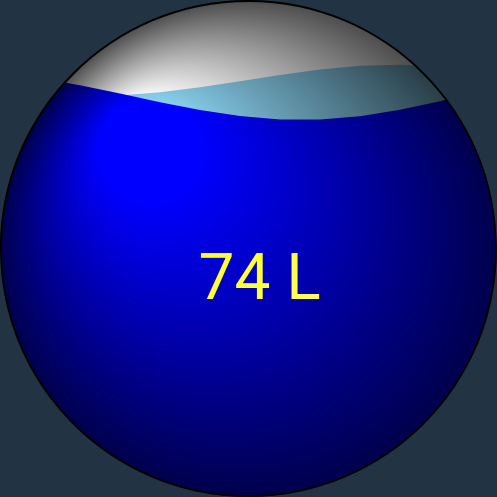

# Tankfill

An animated gauge for showing water fill levels in OpenHAB.

# Install

Copy the `tankfill/tankfill.js` folder to `/etc/openhab/html/`

Import `Tankanzeige.widget.json` into your custom widgets.

# Configuration

There are 3 configuration items:

1. Wave size: Amplitude of the waves (default 16)
2. Wave length: Width of the waves (default 5)
3. Tank size: Volume of your tank, needed to calculate fill level.

